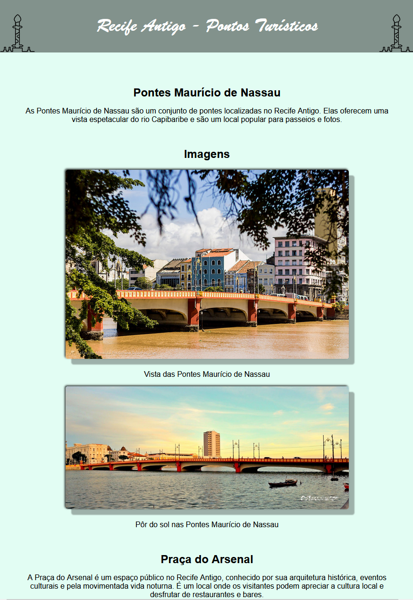
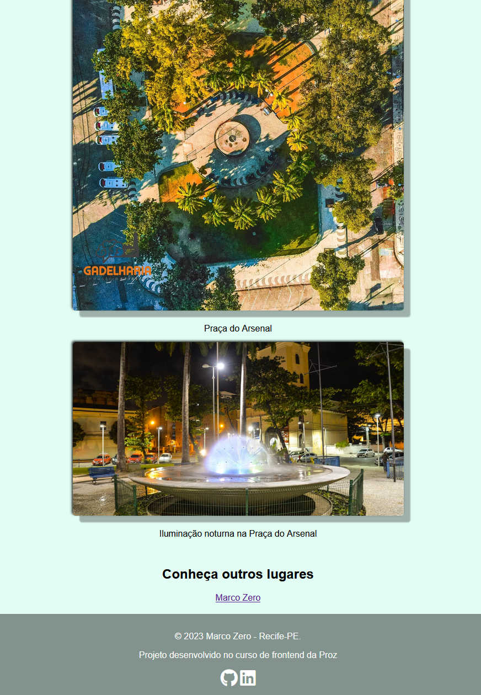
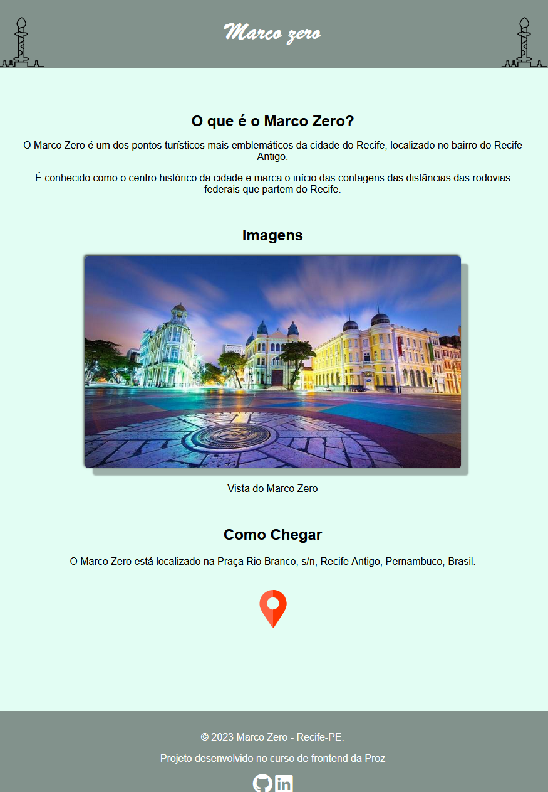
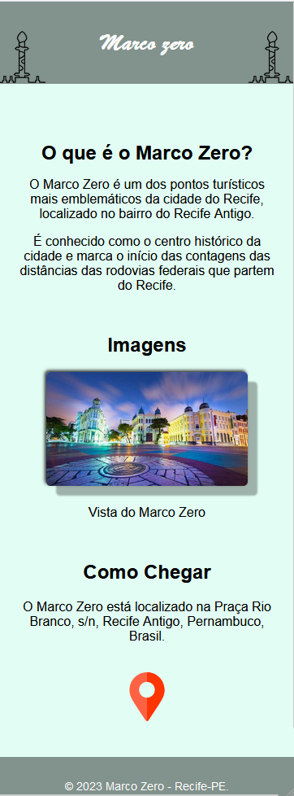
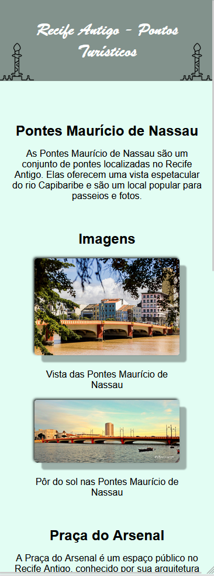

# Recife Antigo

## Descrição
Este projeto é uma página web informativa sobre locais turísto no recife antigo, com alguns dos pontos turísticos mais emblemáticos da cidade do Recife, localizado no bairro do Recife Antigo.

## Tecnologias Utilizadas
- HTML
- CSS
- Biblioteca Font Awesome

## imagens

## 💻 Como foi Desenvolvido
O projeto foi desenvolvido utilizando HTML para a estrutura da página e CSS para estilos e layout. Foram aplicadas boas práticas de design responsivo para garantir uma experiência consistente em dispositivos de diferentes tamanhos.

## Funcionalidades
Informações sobre o Marco Zero, incluindo descrição, imagens e localização.
Link para visualização no Google Maps.
Layout responsivo para se adaptar a telas de diferentes dispositivos.

## Como Executar o Projeto
Basta abrir o arquivo index.html em um navegador web para visualizar a página.

## Autor

- [Seu Nome]

## Licença

Este projeto está sob a licença [Nome da Licença] - veja o arquivo [LICENSE.md](LICENSE.md) para detalhes.

## Agradecimentos

- Este projeto foi desenvolvido como parte do curso de frontend da Proz.